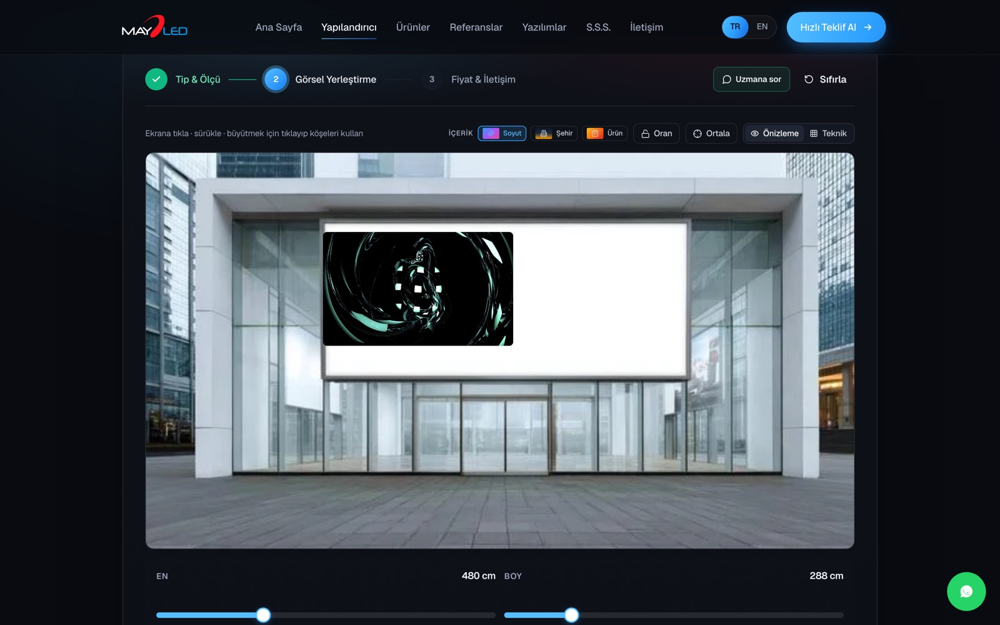
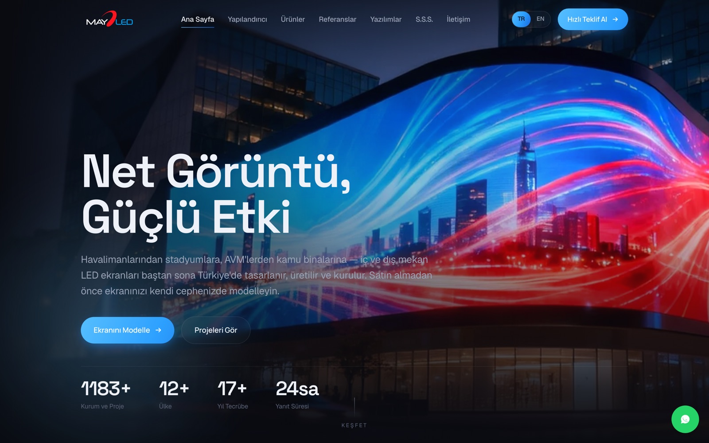
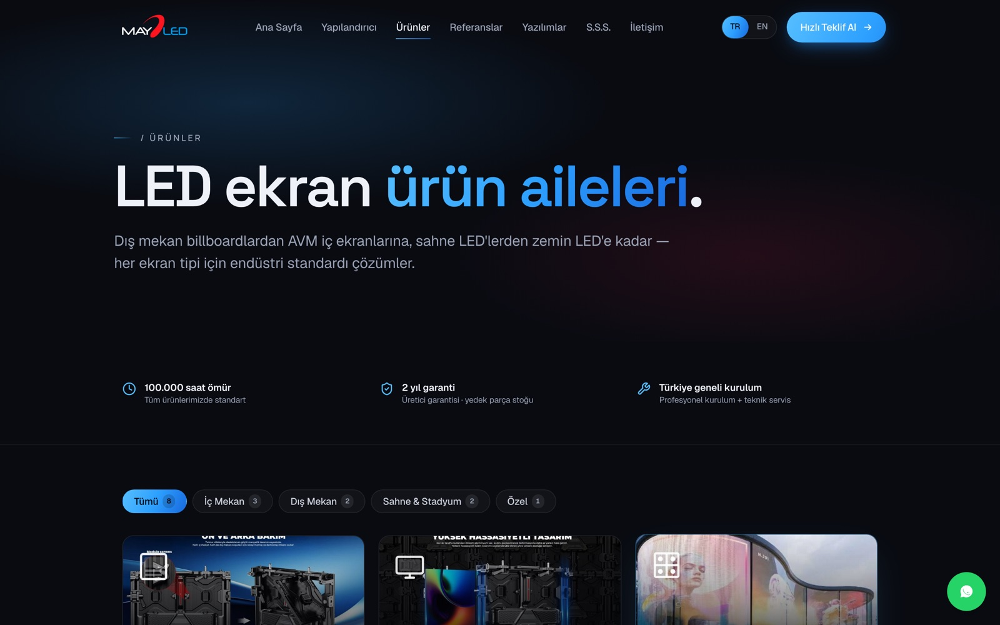
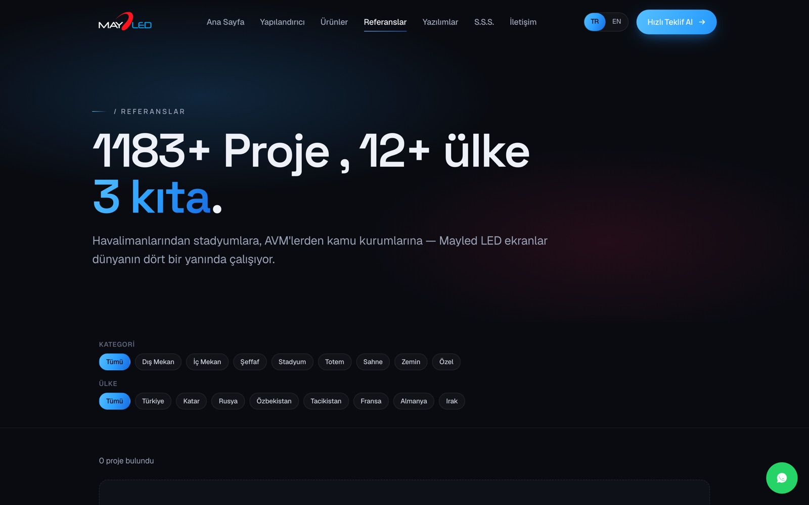
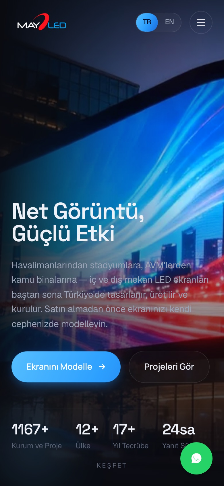
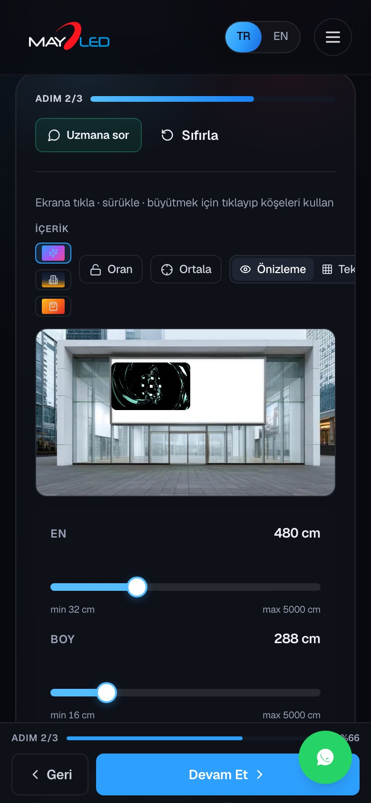
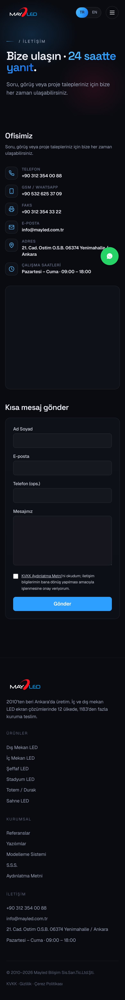

# Mayled

Web platform for an LED display manufacturer. It's a bilingual marketing site with a full admin panel, plus an interactive tool that lets a visitor mock up an LED screen on a photo of their own building and get a price estimate.

**Live:** [mayled.com.tr](https://mayled.com.tr)

The source is private since it's a live commercial site. This repo documents what the project is and how it's built.

## The configurator

This is the main feature. A visitor picks a screen type and dimensions, drags and resizes a virtual screen over a real façade photo, and gets a price range on the spot.

I built the placement as a positioned DOM element with CSS transforms rather than a canvas. The site runs on cheap shared hosting, so keeping memory and CPU low mattered, and a DOM overlay was lighter and easier to make responsive. It has aspect-ratio locking, a measurement/technical view, and a hand-off to WhatsApp for an expert.

## Admin panel

The owner runs the whole site from a panel without touching code: products, case studies, client logos, software downloads, FAQ, homepage copy and images, and an on/off switch for each section. Content lives in the database (typed tables plus a small key-value settings store for things that would normally be hard-coded), and saving revalidates the affected pages so the change shows up immediately.

## Stack

- Next.js 15 (App Router) and React 19, TypeScript
- MySQL with Drizzle ORM
- Auth.js v5 (credentials, bcrypt, JWT sessions)
- next-intl for TR/EN with localized URLs (`/urunler` and `/products`)
- Tailwind CSS
- Resend and Nodemailer for lead notifications
- Playwright and Vitest for tests
- Hostinger, deployed automatically from GitHub

## Things I worked through

Most of the interesting work was getting a modern Next.js app to run well on a constrained CloudLinux/Passenger shared host:

- Self-hosted the fonts so the build no longer depends on fetching Google Fonts at build time (a failed fetch there had been breaking deploys).
- Moved image optimization to the browser: uploads are downscaled and converted to WebP with a canvas before they're sent, so the server never has to process images.
- Fixed runtime issues specific to that host, like loading environment variables independently of the deploy directory layout and setting the canonical auth URL so logins redirect correctly behind the proxy.

Beyond hosting, the goal was that the owner never needs a developer for day-to-day changes, so nearly everything on the public site is editable from the panel and reflected live through ISR revalidation. The whole thing is responsive down to 320px and checked across iPhone sizes.

## My role

Solo project. Design, front end, back end, database schema, auth, internationalization, the admin panel, the configurator, and the deployment.

## Screenshots

| Home | Products | Case studies |
|---|---|---|
|  |  |  |

Mobile:

| Home | Configurator | Contact |
|---|---|---|
|  |  |  |
